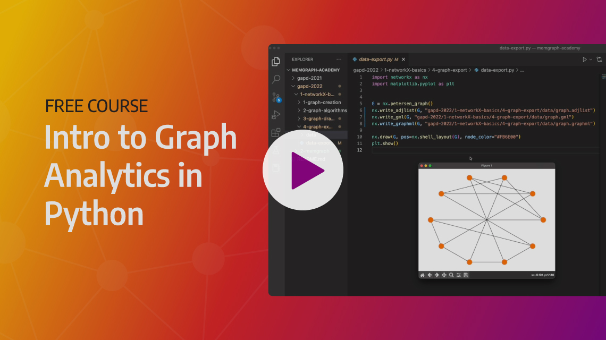

<!-- import CtaButton from "@site/src/components/cta-button/cta-button"; -->

Welcome to the **Memgraph's guide for NetworkX library**!  
This site provides current and useful information about the **NetworkX** Python library for studying graphs and networks.  

With this site, we hope to combine all the relevant resources like guides, tutorials, references, etc. into an open platform that is **free for everyone to use and contribute to**. We would also like to emphasize the importance of graph analytics in fast evolving world of data.

If you want to quickly learn all about graphs and how to analyze them sign up for the **Intro to Graph Analytics in Python free course**. Get to know the graph analytics tools landscape and see engaging examples to find out how to use the most powerful network analysis Python tools.

<!-- <CtaButton title="Sign up for the course" url="https://memgr.ph/intro-to-graph-analytics-in-python"></CtaButton> -->

The documentation is divided into the following sections:
* **[Getting started](/getting-started)** - A beginner guide for developers who are new to the world of network analysis.
* **[Visualizing graphs](/visualization)** - A section dedicated to graph visualization functionalities. 
* **[Functions](/functions)** - A complete list of all functions available in NetworkX.
* **[Algorithms](/algorithms)** - Graph algorithms explained in simple terms with accompanying usage examples. 
* **[Biggest challenges](/biggest-challenges)** - Learn how to overcome the biggest challenges when working with NetworkX.
* **[Other resources](/other-resources)** - A compilation of NetworkX related resources. 
* **[FAQ](/faq)** - Read the most common questions asked on community channels and learn answers to them.

