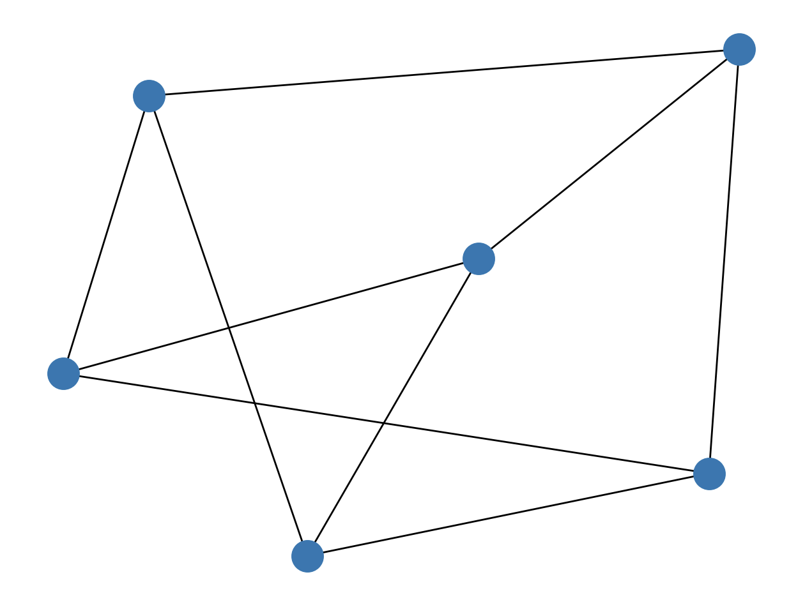
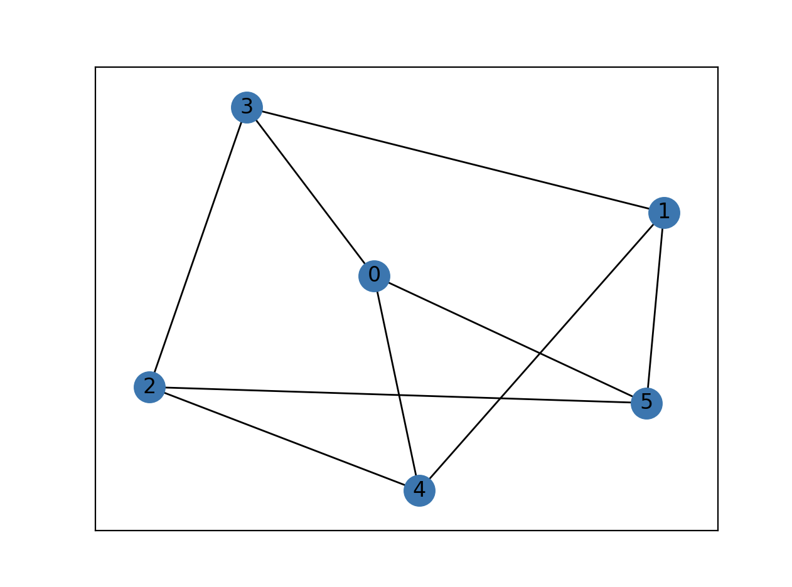
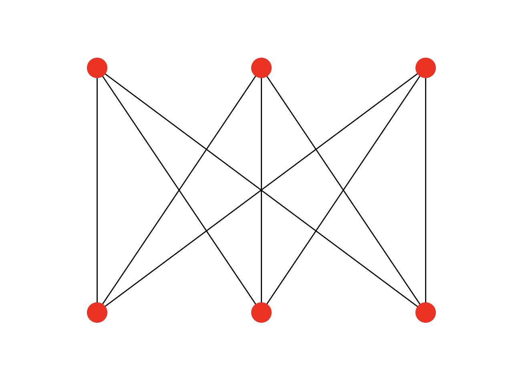

import Tabs from '@theme/Tabs'; import TabItem from '@theme/TabItem';

## Draw methods

You can draw the graph using two drawing methods: `draw()` and `draw_networkx()`. With `draw()` you can draw a simple graph with no node labels or edge labels and using the full Matplotlib figure area and no axis labels by default, while `draw_networkx()` allows you to define more options and customize your graph. 

Let's say we defined a complete bipartite graph as below:

```python
import networkx as nx
import matplotlib.pyplot as plt

K33 = nx.complete_bipartite_graph(3, 3)
```

To draw it with `draw()` method, we use the following code:

```python
nx.draw(K33)
plt.show()
```

The output: 




On the other hand, if we use `draw_networkx()` method, we need to run the following code for the default options:

```python
nx.draw_networkx(K33)
plt.show()
```

The output: 



## Layouts

Graph layout will define node position for your graph drawing. There are a bunch of predefined layouts in NetworkX. The default one is called `spring_layout()` which poistions nodes using Fruchterman-Reingold force-directed algorithm.

Let's show the basic usage of graph layouts on a simple graph example. 

```python
import networkx as nx
import matplotlib.pyplot as plt

G = nx.dodecahedral_graph()
nx.draw(G)
plt.show()
```

Since we did not define any layout above, the default `spring_layout()` will be used.

If we want to draw the same graph with the `shell_layout()` that positiones nodes in concentric circles, we would use the following code:

```python
nx.draw(G, pos=nx.shell_layout(G))
plt.show()
```

For `spiral_layout()` run:

```python
nx.draw(G, pos=nx.spiral_layout(G))
plt.show()
```

Here is how these three layouts look like:


## Positions

You can use the exact positions of the nodes, instead of using predefined layouts. To do that, you need to define a dictionary with nodes as keys and positions as values. 

**Example**

<Tabs
  groupId="example_2"
  defaultValue="code"
  values={[
    {label: 'Python code', value: 'code'},
    {label: 'Output', value: 'output'},
  ]
}>
  <TabItem value="code"> 

```python
import networkx as nx
import matplotlib.pyplot as plt

K33 = nx.complete_bipartite_graph(3, 3)

positions = {0: [-1, 1], 1: [0, 1], 2: [1, 1], 3: [-1, -1], 4: [0, -1], 5: [1, -1]}
ax = plt.figure().gca()
ax.set_axis_off()
options = {"node_size": 300, "node_color": "red"}
nx.draw_networkx(K33, positions, with_labels=False, **options)
plt.show()
```
  </TabItem>


  <TabItem value="output">



  </TabItem>

</Tabs>


## Graph styling

There are numerous styling options which let you customize your graph. For example, you can define colors of the nodes, draw node and edge labels, change font size, etc. Below you can check out a simple example of graph styling.

<Tabs
  groupId="styling"
  defaultValue="graphml"
  values={[
    {label: 'Input file', value: 'graphml'},
    {label: 'Python code', value: 'code'},
    {label: 'Output', value: 'output'},
  ]
}>
  <TabItem value="graphml"> 

  Let's say we want to read a graph from the following `graph.gaphml` file:

```xml
<?xml version='1.0' encoding='utf-8'?>
<graphml xmlns="http://graphml.graphdrawing.org/xmlns" xmlns:xsi="http://www.w3.org/2001/XMLSchema-instance" xsi:schemaLocation="http://graphml.graphdrawing.org/xmlns http://graphml.graphdrawing.org/xmlns/1.0/graphml.xsd">
  <key id="d8" for="edge" attr.name="type" attr.type="string" />
  <key id="d7" for="node" attr.name="followers" attr.type="int" />
  <key id="d6" for="node" attr.name="platform" attr.type="string" />
  <key id="d5" for="node" attr.name="username" attr.type="string" />
  <key id="d4" for="node" attr.name="fraudReported" attr.type="boolean" />
  <key id="d3" for="node" attr.name="compromised" attr.type="boolean" />
  <key id="d2" for="node" attr.name="age" attr.type="int" />
  <key id="d1" for="node" attr.name="name" attr.type="string" />
  <key id="d0" for="node" attr.name="label" attr.type="string" />
  <graph edgedefault="directed">
    <node id="1">
      <data key="d0">Person</data>
      <data key="d1">John Doe</data>
      <data key="d2">40</data>
    </node>
    <node id="2">
      <data key="d0">CreditCard</data>
      <data key="d1">Visa</data>
      <data key="d3">False</data>
    </node>
    <node id="3">
      <data key="d0">Store</data>
      <data key="d1">Walmart</data>
    </node>
    <node id="4">
      <data key="d0">Category</data>
      <data key="d1">Grocery store</data>
    </node>
    <node id="5">
      <data key="d0">Pos</data>
      <data key="d3">False</data>
    </node>
    <node id="6">
      <data key="d0">Transaction</data>
      <data key="d4">False</data>
    </node>
    <node id="22">
      <data key="d0">SocialMedia</data>
      <data key="d5">john_doe</data>
      <data key="d6">Facebook</data>
      <data key="d7">2000</data>
    </node>
    <edge source="1" target="2">
      <data key="d8">OWNS</data>
    </edge>
    <edge source="1" target="22">
      <data key="d8">HAS_ACCOUNT</data>
    </edge>
    <edge source="2" target="6">
      <data key="d8">HAS_TRANSACTION</data>
    </edge>
    <edge source="3" target="4">
      <data key="d8">IS_OF_CATEGORY</data>
    </edge>
    <edge source="3" target="5">
      <data key="d8">HAS_POS_DEVICE</data>
    </edge>
    <edge source="6" target="5">
      <data key="d8">TRANSACTION_AT</data>
    </edge>
  </graph>
</graphml>
```

  </TabItem>

  <TabItem value="code"> 

Then we can import it and style it with the code:
```python
import networkx as nx
import matplotlib.pyplot as plt
import numpy as np

# Importing graphs from a file
G = nx.read_graphml("graph.graphml")

# Defining the node colors
colors = np.linspace(0, 1, len(G.nodes))

pos = nx.circular_layout(G)
nx.draw(
    G, pos, node_size=1000, node_color=colors
)  # draws directed graph, nx.draw(G, arrows=False) for removing arrows

# Draw node labels and change font size
node_labels = nx.get_node_attributes(G, "label")
nx.draw_networkx_labels(G, pos, labels=node_labels, font_size=10)

# Draw edge labels
edge_labels = nx.get_edge_attributes(G, "type")
nx.draw_networkx_edge_labels(G, pos, edge_labels=edge_labels)

plt.show()
```
  </TabItem>


  <TabItem value="output">

  The output of the previous Python code looks like this:


  </TabItem>

</Tabs>

## Other examples

Here is an example of how to draw a simple graph:

<Tabs
  groupId="example_1"
  defaultValue="code"
  values={[
    {label: 'Python code', value: 'code'},
    {label: 'Output', value: 'output'},
  ]
}>
  <TabItem value="code"> 

```python
import matplotlib.pyplot as plt
import networkx as nx

G = nx.petersen_graph()
plt.subplot(121)

nx.draw(G, with_labels=True, font_weight='bold', node_color='orange')
plt.subplot(122)

nx.draw_shell(G, nlist=[range(5, 10), range(5)], with_labels=True, font_weight='bold', node_color='orange')

plt.show()
```
  </TabItem>


  <TabItem value="output">


  </TabItem>

</Tabs>


Here are some other options for drawing graphs:

<Tabs
  groupId="example_2"
  defaultValue="code"
  values={[
    {label: 'Python code', value: 'code'},
    {label: 'Output', value: 'output'},
  ]
}>
  <TabItem value="code"> 

```python
import matplotlib.pyplot as plt
import networkx as nx

options = {
    'node_color': 'orange',
    'node_size': 100,
    'width': 3,
}

G = nx.petersen_graph()

plt.subplot(221)
nx.draw_random(G, **options)

plt.subplot(222)
nx.draw_circular(G, **options)

plt.subplot(223)
nx.draw_spectral(G, **options)

plt.subplot(224)
nx.draw_shell(G, nlist=[range(5,10), range(5)], **options)

plt.show()
```
  </TabItem>


  <TabItem value="output">

  The output of the previous Python code looks like this:


  </TabItem>

</Tabs>

## Useful tips

### How to draw directed graphs using NetworkX in Python?

By using the base class for directed graphs, [DiGraph](https://networkx.org/documentation/stable//reference/classes/digraph.html)(), 
we are able to draw a directed graph with arrows to indicate the direction of edges.

<Tabs
  groupId="how_to_1"
  defaultValue="code"
  values={[
    {label: 'Python code', value: 'code'},
    {label: 'Output', value: 'output'},
  ]
}>
  <TabItem value="code"> 

```python
import networkx as nx
import matplotlib.pyplot as plt

G = nx.DiGraph()
G.add_edges_from(
    [('A', 'B'), ('A', 'C'), ('D', 'B'), ('E', 'C'), ('E', 'F'),
     ('B', 'H'), ('B', 'G'), ('B', 'F'), ('C', 'G')])

nx.draw(G)

plt.show()
```
  </TabItem>


  <TabItem value="output">


  </TabItem>

</Tabs>


### How to draw a NetworkX graph with labels?

If you want the node labels to be visible in your drawing, just add `with_labels=True` to the `nx.draw` call.

<Tabs
  groupId="how_to_2"
  defaultValue="code"
  values={[
    {label: 'Python code', value: 'code'},
    {label: 'Output', value: 'output'},
  ]
}>
  <TabItem value="code"> 

```python
import networkx as nx
import matplotlib.pyplot as plt

G=nx.Graph()
G.add_edge("Node1", "Node2")
nx.draw(G, with_labels = True)

plt.show()
```
  </TabItem>


  <TabItem value="output">


  </TabItem>

</Tabs>

### How to change the color and width of edges in NetworkX graphs according to edge attributes?

Dictionaries are the underlying data structure used for NetworkX graphs, and as of Python 3.7+ they maintain insertion order. 
You can use the `nx.get_edge_attributes()` function to retrieve edge attributes. For every run, we are guaranteed to have the same edge order.

<Tabs
  groupId="how_to_3"
  defaultValue="code"
  values={[
    {label: 'Python code', value: 'code'},
    {label: 'Output', value: 'output'},
  ]
}>
  <TabItem value="code"> 

```python
import networkx as nx
import matplotlib.pyplot as plt

G = nx.Graph()
G.add_edge(1, 2, color='r' ,weight=3)
G.add_edge(2, 3, color='b', weight=5)
G.add_edge(3, 4, color='g', weight=7)

pos = nx.circular_layout(G)

colors = nx.get_edge_attributes(G,'color').values()
weights = nx.get_edge_attributes(G,'weight').values()

nx.draw(G, pos, edge_color=colors, width=list(weights))

plt.show()
```
  </TabItem>


  <TabItem value="output">


  </TabItem>

</Tabs>

### How to color nodes in NetworkX graphs?

You need to define a color map that assigns a color to each node.
For example, if were to color the first 15 nodes of a graph in `orange`, and the rest in `blue`, then the code would be:

<Tabs
  groupId="how_to_4"
  defaultValue="code"
  values={[
    {label: 'Python code', value: 'code'},
    {label: 'Output', value: 'output'},
  ]
}>
  <TabItem value="code"> 

```python
import networkx as nx
import matplotlib.pyplot as plt

G = nx.karate_club_graph()
color_map = []
for node in G:
    if node < 15:
        color_map.append('orange')
    else: 
        color_map.append('blue')      

nx.draw(G, node_color=color_map, with_labels=True)

plt.show()
```
  </TabItem>


  <TabItem value="output">


  </TabItem>

</Tabs>


### How to color nodes in NetworkX graphs according to their attributes?

You need to define a color map that assigns a color to each node.

<Tabs
  groupId="how_to_5"
  defaultValue="code"
  values={[
    {label: 'Python code', value: 'code'},
    {label: 'Output', value: 'output'},
  ]
}>
  <TabItem value="code"> 

```python
import networkx as nx
import matplotlib.pyplot as plt

G = nx.Graph()
G.add_node('A', color='red')
G.add_node('B', color='green')
G.add_node('C', color='blue')

G.add_edges_from(
    [('A', 'B'), ('A', 'C'), ('B', 'C')])

colors = [node[1]['color'] for node in G.nodes(data=True)]

nx.draw(G, node_color=colors, with_labels=True, font_color='white')

plt.show()
```
  </TabItem>


  <TabItem value="output">


  </TabItem>

</Tabs>

## Where to next?

If you wish to learn more about drawing graphs with NetworkX, visit the [`draw_networkx()`](https://networkx.org/documentation/stable/reference/generated/networkx.drawing.nx_pylab.draw_networkx.html#networkx.drawing.nx_pylab.draw_networkx) and [Graph Layout](https://networkx.org/documentation/stable/reference/drawing.html#module-networkx.drawing.layout) sections in the NetworkX reference guide. If you find this kind of drawing complicated and it is not working that well for your scale, check out how to visualise your graphs easy [**here**](https://memgraph.com/memgraph-for-networkx?utm_source=networkx-guide&utm_medium=referral&utm_campaign=networkx_ppp&utm_term=visualization%2Bbasics&utm_content=visualizeiteasy).
